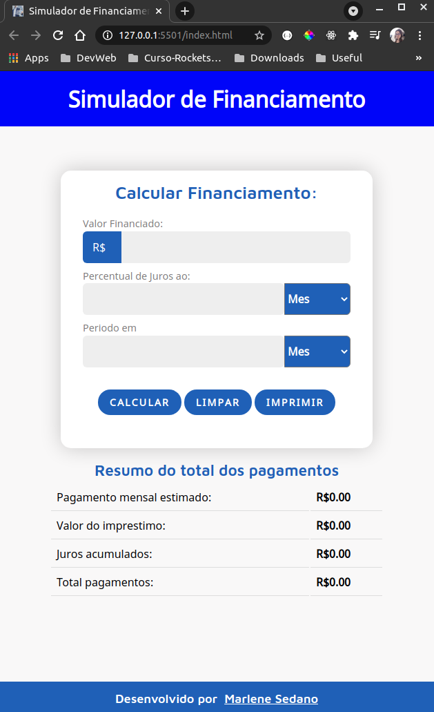
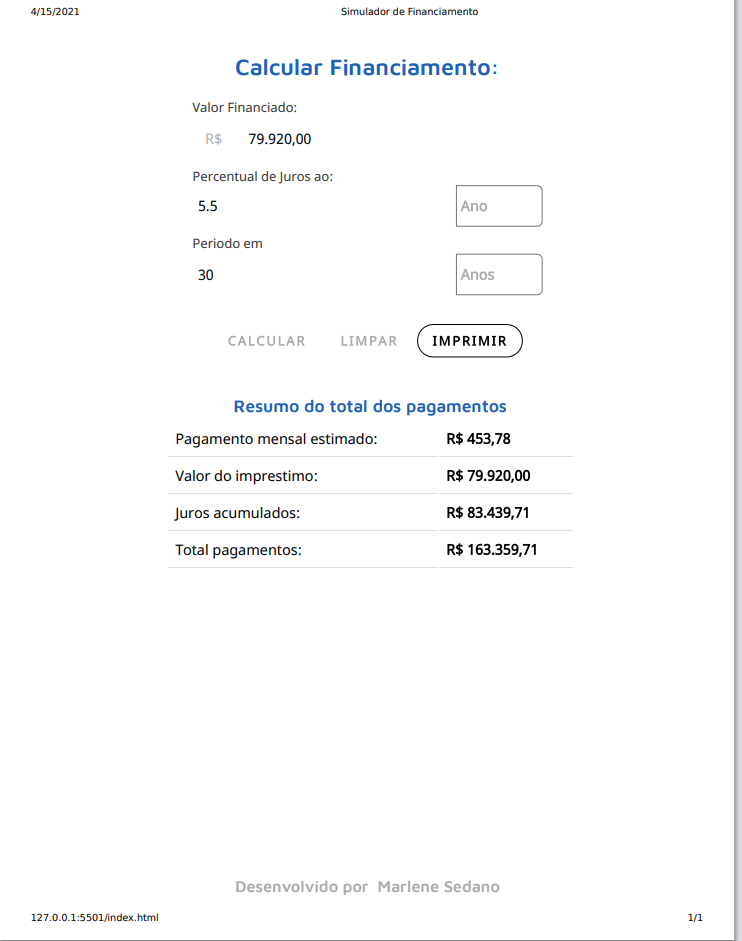

# Calculo de Financiamento - JavaScript Puro (Responsivo)

Este projeto foi desenvolvido para aprendizado.

## Projeto Calculo de Financiamento

Calculo Simples de financiamento, com calculando
juros ao ano e ao mes, este o projetinho foi feito para
aprimorar conhecimento de HTML, CSS e JavaScript. O projeto
esta responsivo para mobile.

## :rocket: Tecnologias

Este projeto foi desenvolvido com as seguintes tecnologias:

- HTML
- Css
- JavaScript

                                                     
## Demonstração
 


Ao preencher o campo Valor Financiado, o percentual de juros (escolher se é juros mensal ou anual), adicionar o periodo (em meses ou em ano), o sistema ira calcular
a média do valor de parcela, o valor total do emprestimo, total de juros acumulado e o total de pagamento somando o valor do Juros.


O sistema conta também com impressão,  caso o usuário queira imprimir a simulação do empréstimo, para isso basta selecionar a opção IMPRIMR após calcular o financiamento. 




## Como usar

```
O sistema esta disponivel online através do seguinte link:

https://calculadora-financiamento.vercel.app/

E o repositório esta no seguinte caminho:

# Clone este repositório
$ git clone https://github.com/marlenesedano/calculadora_financiamento.git


